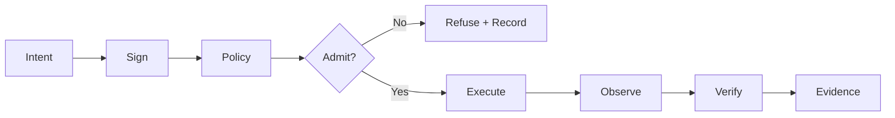

<div align="center">

# FEBIN FRANCIS

### Systems Engineer · AI Infrastructure · Verifiable Compute

**Building systems that prove what happened instead of asking you to trust what happened.**

`AI Agents` · `Sovereign AI` · `MCP` · `Local LLMs` · `Zero-Knowledge` · `Distributed Systems`

[Portfolio](https://codesbyfebin.github.io/) · [LinkedIn](https://www.linkedin.com/in/codes-by-febin/) · [ORCID](https://orcid.org/0009-0002-8123-1531)

</div>

---

## SYSTEM PROFILE

```text
ENGINEER       Febin Francis
HANDLE         CodesbyFebin
FOCUS          AI Infrastructure · Verifiable Compute · Sovereign Systems
BUILDS         Agents · runtimes · protocols · control planes · proof systems
PRINCIPLE      Measure → Verify → Admit → Execute → Prove
UNMEASURED     UNKNOWN
```

I design infrastructure around **signed intent, local policy, explicit execution state, evidence, and reproducible verification**.

If a capability is simulated, it should say **SIMULATED**.  
If it has not been measured, it should say **UNKNOWN**.  
If it cannot pass the gate, it should not silently pass.

## WHAT I BUILD

| Domain | Engineering focus | Technologies |
|---|---|---|
| **Agentic Infrastructure** | Agents with explicit tools, policies, permissions and machine-readable contracts | MCP · Agents · Local LLMs · Tool Gateways |
| **Sovereign Infrastructure** | Operator authority over identity, admission, execution and data | Ed25519 · mTLS · WireGuard · Raft |
| **Verifiable Compute** | Execution claims that can be independently checked | STARKs · AIR · Winterfell · Attestation |
| **Distributed Systems** | Explicit desired, admitted, observed and verified state | BLAKE3 · Merkle Trees · Chaos · Conformance |

## SELECTED SYSTEMS

### [rust-stark-zkvm](https://github.com/CodesbyFebin/rust-stark-zkvm) · Rust

> A small zero-knowledge virtual machine with real STARK proving and verification.

Custom VM ISA → execution trace → AIR → STARK proof → independent verification.

- ADD / SUB / MUL and JZ / JNZ execution
- fixed register architecture with LOAD / STORE
- Winterfell STARK prover and verifier
- HTTP proving and verification API
- MCP prove / verify tools
- CI proof verification gates
- explicit `mock-echo` stub remains identified as mock

### [Decentralized.Host](https://github.com/CodesbyFebin/Decentralized-) · Go

> Self-hosted infrastructure where hosts remain sovereign.

- Ed25519 identities and signed intent
- per-host local admission policy
- desired / admitted / observed state separation
- BLAKE3 CAS and Merkle anti-entropy
- Raft + mTLS control plane
- userspace WireGuard mesh
- chaos and conformance testing
- `dh/v1` specification with independent verification artifacts

### [decentralized.hosting](https://github.com/CodesbyFebin/decentralized.hosting) · Python

> A runnable self-hosted deployment mesh.

```text
FastAPI Control Plane → Scheduler → Docker Node Agent → Traefik → Workload
```

Includes a `dhost` CLI, resource-aware scheduling, rollback, local registry, Docker execution, Traefik edge routing and MCP integration. Later roadmap phases remain separate from implemented Phase 1–2 capability.

### [XFree](https://www.xfree.in) · TypeScript

> Browser-based developer, SEO and AI tooling.

The live application uses **React 19 · TypeScript · Vite 6 · Express 4**, with server-side AI gateways and prerendered discovery surfaces. Live/indexable capabilities remain distinct from draft registry entries.

## ENGINEERING MODEL



```text
DESIRED ≠ ADMITTED ≠ EXECUTING ≠ OBSERVED ≠ VERIFIED
```

Collapsing these states into one green `SUCCESS` badge hides information that should remain inspectable.

## TOOLCHAIN

**Languages**  
Rust · Go · TypeScript · Python · Shell

**Infrastructure & cryptography**  
Winterfell · Raft · BLAKE3 · Ed25519 · WireGuard · Docker · Traefik · FastAPI · MCP

**Quality & verification**  
CodeQL · Playwright · Dependabot · conformance tests · chaos tests · proof gates

## INVARIANTS

```text
FAIL_CLOSED       Unsupported or unverifiable state must not silently become success
NO_FAKE_LIVE      Simulated capabilities stay visibly simulated
UNKNOWN ≠ HEALTHY Missing telemetry cannot become green status
LOCAL_AUTHORITY   The execution host retains admission authority
EVIDENCE > CLAIMS Tests, signatures and artifacts outrank prose
REPRODUCIBLE      Another implementation should be able to verify the contract
SOURCE = PRODUCT  Public capability claims should correspond to inspectable code
```

## DEVELOPER ECOSYSTEM

I build and document systems so they can be understood by **humans, coding agents, automation and external developer platforms** without inventing capabilities that are not present.

| Surface | Role in the engineering workflow |
|---|---|
| **GitHub** | Source, issues, pull requests, CI, security automation, evidence and release history |
| **MCP** | Explicit tool/resource boundary for AI agents and developer automation |
| **Agent Skills** | Reusable, scoped instructions for repeatable engineering workflows |
| **LinkedIn** | Professional identity and public project discovery |
| **Slack** | Team communication and developer collaboration when a workspace integration is configured |
| **Vercel** | Web/application deployment for applicable projects |
| **Docker** | Reproducible workload packaging and local/self-hosted execution |
| **Kubernetes** | Cluster orchestration where a project explicitly implements or validates it |
| **Local LLMs** | Operator-controlled inference paths for sovereign AI workflows |

### Agent-native repository contract

This profile follows the increasingly common separation between human documentation, agent instructions, compact LLM discovery and reusable skills:

```text
README.md
   ├── human technical profile
   ├── implemented systems
   └── verification links

AGENTS.md
   ├── agent operating rules
   ├── claim boundaries
   └── source-of-truth guidance

llms.txt
   ├── compact identity
   ├── project discovery
   └── verification entry points

SKILL.md / skills/
   ├── reusable engineering workflows
   └── evidence-first project inspection

agents.txt / agents.json
   └── machine-readable capability discovery
```

The repository does **not** treat the presence of an MCP server, skill file, social profile or deployment provider as proof of engineering capability. Those surfaces are interfaces. The underlying source, tests, specifications and evidence remain authoritative.

### Collaboration contract

For technical collaboration, start with the relevant repository and its issue/PR history. When an AI agent participates, it should inspect `AGENTS.md` and project-local instructions before modifying source. When a capability claim matters, verify it against source or executable evidence before repeating it.

Public professional identity is linked through LinkedIn and ORCID. Communication platforms such as Slack are workflow integrations, not evidence sources by themselves.

## MACHINE INTERFACE

This profile and the selected repositories expose machine-readable context where available:

```text
README.md  → human orientation
AGENTS.md  → agent-readable project context
llms.txt   → machine-readable discovery
specs/     → normative contracts
evidence/  → verification artifacts
tests/     → executable claims
```

For programmatic interpretation, prefer repository-level `AGENTS.md`, `llms.txt`, specifications, tests and evidence over inferring capability from profile prose.

---

<div align="center">

## PROOF > PROMISES

**BUILD · MEASURE · VERIFY · IMPROVE**

[Portfolio](https://codesbyfebin.github.io/) · [GitHub](https://github.com/CodesbyFebin) · [LinkedIn](https://www.linkedin.com/in/codes-by-febin/) · [ORCID](https://orcid.org/0009-0002-8123-1531)

</div>
